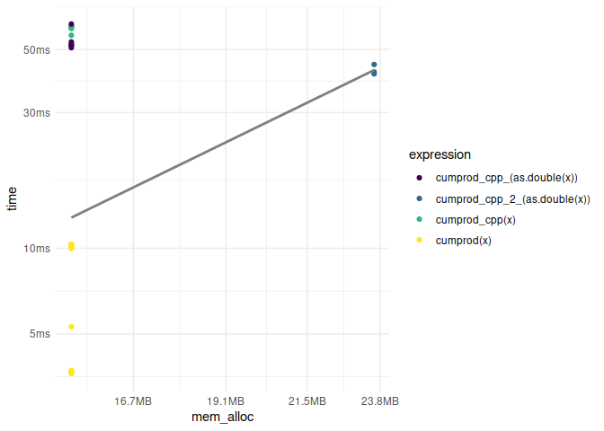
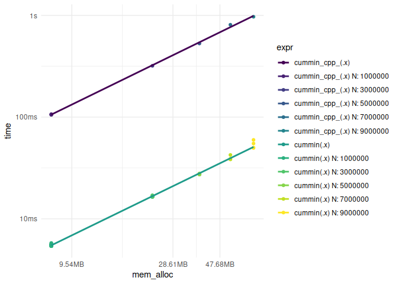

# Functions (part 4)

## Are all values true?

In R we can use `all()` to check if all values in a vector are `TRUE`,
as in:

``` r
all(1:5 > 1)
```

    [1] FALSE

Perhaps the easiest C++ implementation is to define a function that
takes a vector of logicals and returns a single logical value after the
boolean result of a loop over the length of the vector.

``` cpp
[[cpp11::register]] bool all_cpp_1_(cpp11::logicals x) {
  int n = x.size();
  for(int i = 0; i < n; ++i) {
    if (x[i] == false) {
      return false;
    }
  }
  return true;
}
```

I can save lines by not defining `n`.

``` cpp
[[cpp11::register]] bool all_cpp_2_(cpp11::logicals x) {
  for (int i = 0; i < x.size(); ++i) {
    if (x[i] == false) {
      return false;
    }
  }
  return true;
}
```

It is also possible to directly define a logical variable `i` inside the
loop.

``` cpp
[[cpp11::register]] bool all_cpp_3_(cpp11::logicals x) {
  for (bool i : x) {
    if (i == false) {
      return false;
    }
  }
  return true;
}
```

Using `std::all_of()` I can do the same thing in one line.

``` cpp
[[cpp11::register]] bool all_cpp_4_(cpp11::logicals x) {
  return std::all_of(x.begin(), x.end(), [](bool x) { return x; });
}
```

To avoid typing `std::` I can use `using namespace std;` at the top of
`src/code.cpp`.

These functions can be directly called from R, in the previous part the
goal was to write a basic documentation and default parameters by using
auxiliary functions.

Now I need to test if the functions work as expected.

``` r
# just to make sure I am in the right folder when rendering the qmd file
setwd("~/github/cpp-for-r-users/ece244")

load_all()
```

    ℹ Loading ece244

``` r
set.seed(123) # set the seed for reproducibility
x <- rpois(1e6, lambda = 2) # 1,000,000 elements

all(x > 2)
```

    [1] FALSE

``` r
all_cpp_1_(x > 2)
```

    [1] FALSE

``` r
all_cpp_2_(x > 2)
```

    [1] FALSE

``` r
all_cpp_3_(x > 2)
```

    [1] FALSE

``` r
all_cpp_4_(x > 2)
```

    [1] FALSE

``` r
# also test the TRUE only case
all(x >= 0)
```

    [1] TRUE

``` r
all_cpp_1_(x >= 0)
```

    [1] TRUE

``` r
all_cpp_2_(x >= 0)
```

    [1] TRUE

``` r
all_cpp_3_(x >= 0)
```

    [1] TRUE

``` r
all_cpp_4_(x >= 0)
```

    [1] TRUE

Now I can care about the benchmarking.

``` r
mark(
    all(x > 2),
    all_cpp_1_(x > 2),
    all_cpp_2_(x > 2),
    all_cpp_3_(x > 2),
    all_cpp_4_(x > 2)
)
```

    # A tibble: 5 × 6
      expression             min   median `itr/sec` mem_alloc `gc/sec`
      <bch:expr>        <bch:tm> <bch:tm>     <dbl> <bch:byt>    <dbl>
    1 all(x > 2)          4.87ms   4.96ms      200.    3.81MB     19.1
    2 all_cpp_1_(x > 2)   4.87ms   4.97ms      200.    3.81MB     25.3
    3 all_cpp_2_(x > 2)   4.89ms   4.97ms      198.    3.81MB     24.7
    4 all_cpp_3_(x > 2)   4.89ms   4.98ms      196.    3.81MB     30.8
    5 all_cpp_4_(x > 2)   4.91ms   5.01ms      199.    3.81MB     19.1

My functions are marginally better (in terms of speed) than base R.

## Cumulative product

In R we can use `cumprod()` to compute the cumulative product of a
vector.

``` r
cumprod(1:5)
```

    [1]   1   2   6  24 120

The C++ implementation can use the shortcuts from the previous part.

``` cpp
[[cpp11::register]] cpp11::doubles cumprod_cpp_(cpp11::doubles x) {
  int n = x.size();
  writable::doubles out(n);
  out[0] = x[0];
  for(int i = 1; i < n; ++i) {
    out[i] = out[i - 1] * x[i];
  }
  return out;
}
```

I can test the correctness of the function.

``` r
# just to make sure I am in the right folder when rendering the qmd file
setwd("~/github/cpp-for-r-users/ece244")

load_all()
```

    ℹ Loading ece244

``` r
cumprod(1:5)
```

    [1]   1   2   6  24 120

``` r
cumprod_cpp_(1:5)
```

    Error: Invalid input type, expected 'double' actual 'integer'

I need an auxiliary function to cast the input as double.

``` r
#' @export
cumprod_cpp <- function(x) {
  cumprod_cpp_(as.double(x))
}
```

Now I can test the correctness of the function again.

``` r
# just to make sure I am in the right folder when rendering the qmd file
setwd("~/github/cpp-for-r-users/ece244")

load_all()
```

    ℹ Loading ece244

``` r
cumprod(1:5)
```

    [1]   1   2   6  24 120

``` r
cumprod_cpp(1:5)
```

    [1]   1   2   6  24 120

Now I can benchmark the functions.

``` r
set.seed(123) # set the seed for reproducibility
x <- rpois(1e6, lambda = 2) # 1,000,000 elements

mark(
    cumprod(x),
    cumprod_cpp(x)
)
```

    # A tibble: 2 × 6
      expression          min   median `itr/sec` mem_alloc `gc/sec`
      <bch:expr>     <bch:tm> <bch:tm>     <dbl> <bch:byt>    <dbl>
    1 cumprod(x)        3.6ms   3.75ms     177.     15.3MB    207. 
    2 cumprod_cpp(x)   52.5ms  57.52ms      17.5    15.3MB     21.9

The C++ implementation is slower than base R.

One remedial solution is not to define the length of the vector and add
one coordinate on each step.

``` cpp
[[cpp11::register]] cpp11::doubles cumprod_cpp_2_(cpp11::doubles x) {
  int n = x.size();
  writable::doubles out;
  out.push_back(x[0]);
  for(int i = 1; i < n; ++i) {
    out.push_back(out[i - 1] * x[i]);
  }
  return out;
}
```

The benchmark is.

``` r
# just to make sure I am in the right folder when rendering the qmd file
setwd("~/github/cpp-for-r-users/ece244")

load_all()
```

    ℹ Loading ece244

``` r
set.seed(123) # set the seed for reproducibility
x <- rpois(1e6, lambda = 2) # 1,000,000 elements

library(ggplot2)
library(dplyr)
```


    Attaching package: 'dplyr'

    The following objects are masked from 'package:stats':

        filter, lag

    The following objects are masked from 'package:base':

        intersect, setdiff, setequal, union

``` r
library(tidyr)

results <- mark(
    cumprod(x),
    cumprod_cpp(x),
    cumprod_cpp_(as.double(x)),
    cumprod_cpp_2_(as.double(x))
)

results %>%
    unnest(c(time, mem_alloc, gc)) %>%
    select(expression, time, mem_alloc, gc) %>%
    filter(gc == "none") %>%
    ggplot(aes(x = mem_alloc, y = time, color = expression)) +
    geom_point() +
    scale_color_viridis_d() +
    geom_smooth(method = "lm", se = F, colour = "grey50") +
    theme_minimal()
```

    `geom_smooth()` using formula = 'y ~ x'



`cumprod_cpp_2_` is faster than `cumprod_cpp_` but still slower than
base R, and it uses more memory than any of the compared function calls.

## Cumulative minimum

Let’s look at this example from R’s documentation.

``` r
c(3:1, 2:0, 4:2)
```

    [1] 3 2 1 2 1 0 4 3 2

``` r
cummin(c(3:1, 2:0, 4:2))
```

    [1] 3 2 1 1 1 0 0 0 0

The function starts with the first element and then it compares the next
element with the current minimum and keeps the smallest value. In this
case, when it reaches zero, the next values in the sequence are zeroes
because there are no negative values in the original vector.

The lesson from the previous part is to avoid growing vectors, it uses
more memory.

The C++ implementation can use the learning from the previous parts.

``` cpp
[[cpp11::register]] cpp11::doubles cummin_cpp_(cpp11::doubles x) {
  int n = x.size();

  // create a vector of 0s
  writable::doubles out(n);

  for (int i = 0; i < n; ++i) {
    out[i] = 0.0;
  }

  out[0] += x[0];

  for (int i = 1; i < n; ++i) {
    if (x[i] < out[i - 1]) {
      out[i] += x[i];
    } else {
      out[i] += out[i - 1];
    }
  }
  return out;
}
```

I can test the correctness of the function.

``` r
# just to make sure I am in the right folder when rendering the qmd file
setwd("~/github/cpp-for-r-users/ece244")

load_all()
```

    ℹ Loading ece244

``` r
cummin(c(3:1, 2:0, 4:2))
```

    [1] 3 2 1 1 1 0 0 0 0

``` r
cummin_cpp_(as.double(c(3:1, 2:0, 4:2)))
```

    [1] 3 2 1 1 1 0 0 0 0

The benchmark is.

``` r
# create random vectors with 1, 3, 5, 9 million elements
set.seed(123) # set the seed for reproducibility
x1 <- as.double(rpois(1e6, lambda = 2))
x2 <- as.double(rpois(3e6, lambda = 2))
x3 <- as.double(rpois(5e6, lambda = 2))
x4 <- as.double(rpois(7e6, lambda = 2))
x5 <- as.double(rpois(9e6, lambda = 2))

results <- purrr::map(
    list(x1, x2, x3, x4, x5),
    ~ mark(
        cummin(.x),
        cummin_cpp_(.x)
    ) %>%
        mutate(n = length(.x))
)

results %>%
    bind_rows() %>%
    unnest(c(time, mem_alloc, gc, n)) %>%
    select(expression, time, mem_alloc, gc, n) %>%
    filter(gc == "none") %>%
    mutate(expr = paste(expression, n, sep = " N: ")) %>%
    ggplot(aes(x = mem_alloc, y = time, color = expr)) +
    geom_point() +
    scale_color_viridis_d() +
    geom_smooth(aes(color = expression), method = "lm", se = F) +
    theme_minimal()
```

    `geom_smooth()` using formula = 'y ~ x'



## References

- [Get started with
  cpp11](https://cpp11.r-lib.org/articles/cpp11.html#intro)
